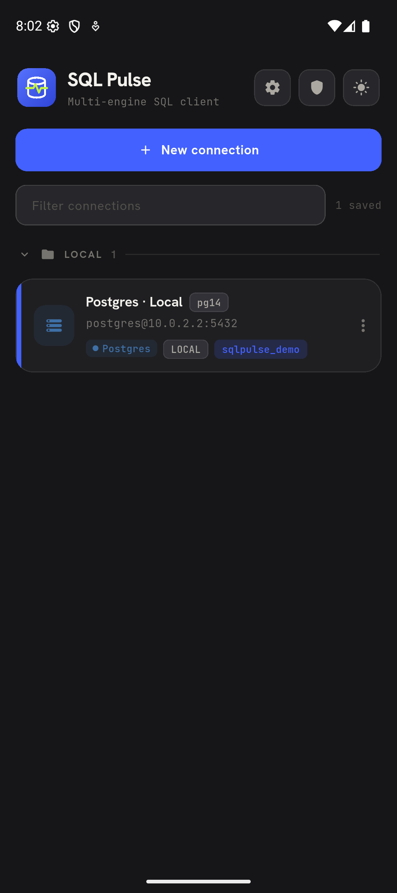
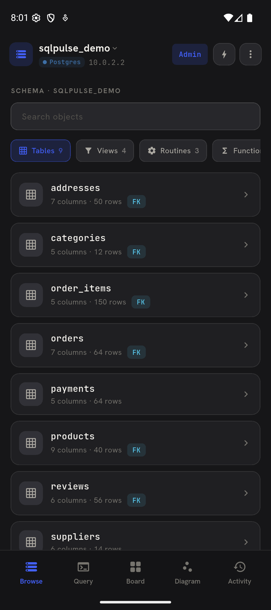
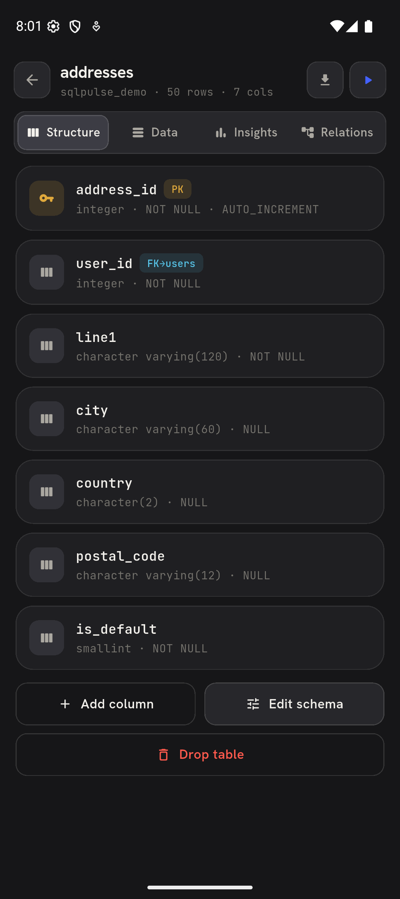
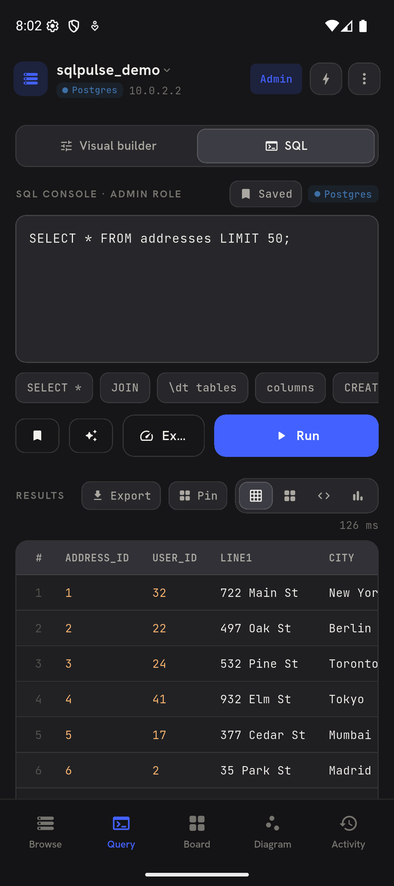
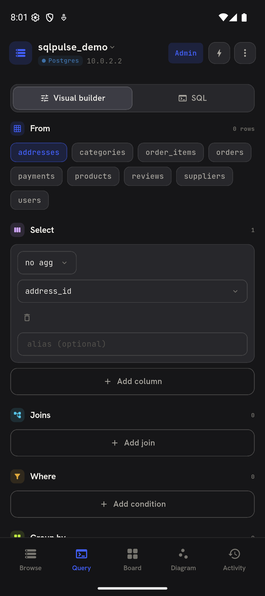
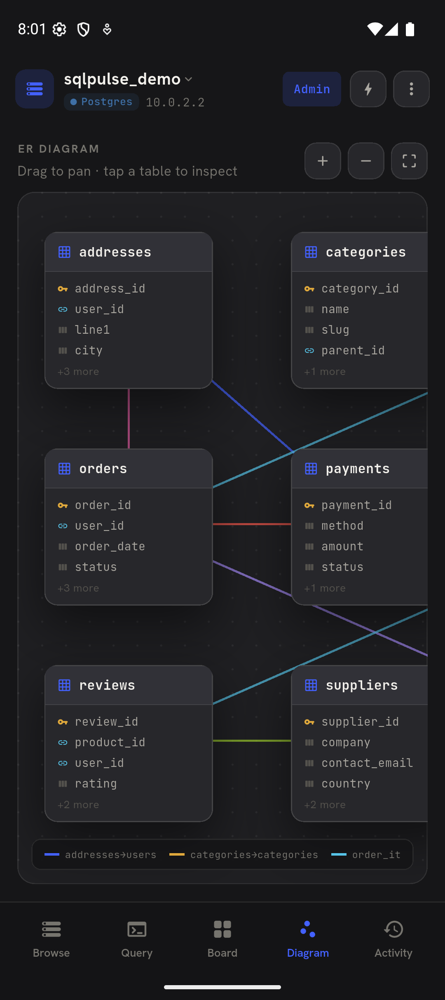

# SQL Pulse

Multi-engine SQL client built with Flutter — browse, query, edit, and visualize
PostgreSQL, MySQL, MariaDB, SQL Server, and SQLite databases from Android,
desktop, or the web.

> ⚠️ **Status: NOT release-ready — the project is under heavy development.**
> Features may change or break between commits. Pending work (known gaps,
> limitations, cleanups) is tracked in [Issues](https://github.com/mrefaie/sql-pulse/issues).

## Screenshots

| | | |
|---|---|---|
|  |  |  |
|  |  |  |

Screenshots: Android emulator (Pixel 9), connected to a local PostgreSQL 14
database seeded with the demo catalog (`sqlpulse_demo`).

## Features (what works today)

- **Connections** — create / edit / duplicate / delete profiles, test connection
  before saving, SSH local port-forward tunnels (key, password, or agent auth),
  SSL toggles, per-engine options, profiles persisted on-device.
- **Engines** — PostgreSQL (primary dev target), MySQL, MariaDB, SQL Server
  (lightweight pure-Dart TDS client — unencrypted servers only), SQLite
  (local files with an auto-seeded demo catalog).
- **Schema browsing** — live introspection: tables, columns, PK/FK/AI, views,
  routines, triggers, row estimates; global schema search; exportable.
- **Data grid** — inline cell editing, insert / delete rows, row inspector,
  column filter-to-query, sensitive-column masking, staging mode (prod) with
  transactional commit/rollback of pending edits.
- **Querying** — SQL console with formatting, real execution plans, multi-statement
  scripts; visual builder (joins, WHERE + subqueries, GROUP BY/HAVING, ORDER,
  CTEs) generating dialect-aware SQL per engine; saved queries.
- **Board** — pin any query result as metric / chart / table cards that re-run
  live against the connection.
- **Schema & data diff** — compare two live connections (ADDED / REMOVED /
  CHANGED columns and row-level deltas, keyed by PK).
- **Safety** — role-based access control (Admin / Developer / Analyst / ReadOnly)
  enforced before every statement with a live audit log; prod-connection
  ribbon; app lock (device biometrics or PIN); everything stays
  on-device — no cloud sync.

## Running

Prerequisites: Flutter ≥ 3.44 (Dart ≥ 3.12).

```bash
flutter pub get
flutter run          # pick your emulator / device
```

Web build (browsers can't open raw TCP — DB work is proxied by a small backend):

```bash
flutter build web
dart run bin/server.dart   # serves on http://localhost:8088
```

Local database (PostgreSQL is the live dev target):

```bash
brew services start postgresql@14
dart run tool/seed_pg.dart   # creates role postgres/pass + database sqlpulse_demo (idempotent)
```

Then connect with the default profile — `Postgres · Local`, user `postgres`.
Use host `127.0.0.1` on desktop / iOS simulator, `10.0.2.2` inside the Android
emulator (the emulator profile ships with `10.0.2.2`). MySQL / MariaDB /
SQL Server profiles expect local Docker containers (infra not shipped yet —
see issue #8). SQLite needs nothing: it seeds a sample catalog on first use.

## Project layout

```
lib/db/        real drivers (postgres, mysql, mssql, sqlite) + ssh tunnel + web proxy client
lib/engine/    SQL generation, formatting, statement splitting
lib/data/      models, on-device store, seed catalogs, diff/mask helpers
lib/state/     AppState: connect, execute, RBAC, staging, audit, board
lib/screens/   workspace tabs, connection editor, designer, sheets
bin/server.dart shelf backend (web proxy + static host)
tool/          seed_pg.dart, ops_probe.dart, feature_probe.dart
```

## Known gaps & roadmap

Tracked in the issue tracker; the notable ones:

- Legacy in-memory SQL engine (`SqlEngine.runSql`/`runBuilder`) is dead code — #1
- Postgres / MySQL connection options collected in the editor but not applied — #2, #3
- SQL Server: servers that require TLS are unsupported; Windows/Azure AD options
  are cosmetic — #4
- Credentials and PIN stored in plain SharedPreferences — #5
- Cross-connection diff is view-only (no apply) — #6
- App-lock fallback is a soft gate (PIN `0000`, auto-approve on biometric errors) — #7
- Docker infra for the MySQL/MariaDB/SQL Server demo profiles — #8
- Scaffold leftovers (README heritage, `com.example` applicationId) — #9

## Tests

`flutter test` runs the unit suite (RBAC, SQL generation, engine helpers).
The integration tests and `tool/ops_probe.dart` / `tool/feature_probe.dart`
exercise real operations against live databases (`sqlpulse_demo` on
PostgreSQL/MySQL/MariaDB/SQL Server).
